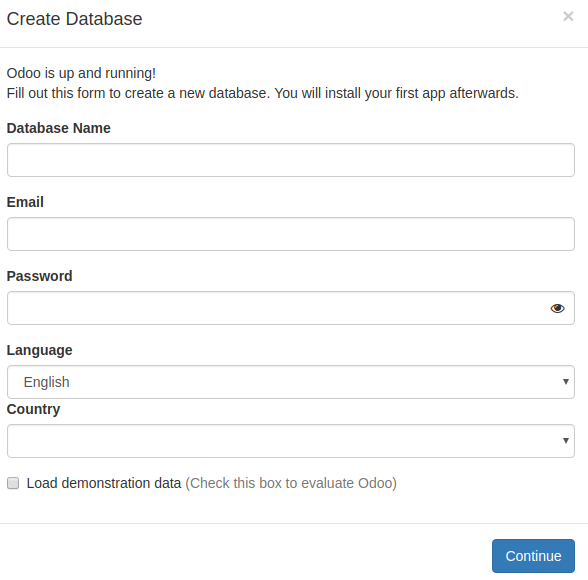
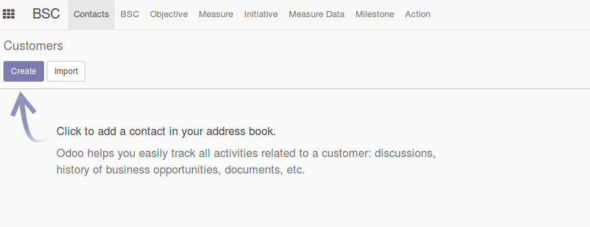

# Balance Scorecard

The balanced scorecard (BSC) is a strategic planning and management system that organizations use to:
* Communicate what they are trying to accomplish
* Align the day-to-day work that everyone is doing with strategy
* Prioritize projects, products, and services
* Measure and monitor progress towards strategic targets

Business are moving towards information age which means management of information is a priority job for them. This also helps to make sure that the past and present performance guarantees good future of the organization. Balanced Scorecard suffice the necessity of report for performance in the past and also indicate the future performance.

> As  companies  around  the  world  transform  themselves  for  competition  that  is based  on  information,  their  ability  to  exploit  intangible  assets  has  become  far more  decisive  than  their  ability  to  invest  in  and  manage  physical  assets. (Kaplan and Norton, 1996)

Every team or organization have vision and mission to execute in certain time. Their success rate can go up if they can manage and analyze recorded data. Normally, business, government and nonprofit organization have big vision and mission to execute and it is difficult to measure them without using any approach. Among different approaches, Balanced Scorecard is one approach to translate clarified visions and mission into an actionable measures. The data collected for an organization is feeded in a system to provide quantitative results. As an outcome from this approach, we will get meaningful information and each activity will have recommendation and feedback to emphasize on each mission.

Strategy Management approach in Nepal is still based on management of manufacturing and financial scores. However, international business has already gone to information age before 15 years which is making harder for Nepali business organization to compete and Balanced scorecard is one of the step to jump towards information era.

## Installation

[](https://asciinema.org/a/TQng7nQpopNfSle1lHs67bSbH)

Your first step is to download and install docker from [here.](https://www.docker.com/get-docker)
#### Or
Go to docker [playground](https://labs.play-with-docker.com)

### Steps
Install Docker Compose  
```
sudo apt-get install docker-compose
```  

Clone github directory in your local folder  

```
git clone https://github.com/diwap/bsc.git bsc
```  

Goto directory  

```
cd bsc
```  

Install using docker compose  

```
docker-compose up -d
```  
This will create two container for:
* Postgresql
* Odoo

Odoo will run in `http://localhost:8069` by default.

Create new database  



Install two application from Apps. They are:
* bsc &
* web_responsive

  

Now we are done and ready to use our application.  


## Development
This application is developed using __visual studio code__. To automate and make development fast I used linux tools i.e. __xdotools__.

First run `runscript.sh`. This will make docker container for odoo and install __xdotool__. Then automatically open firefox browser with odoo link.  

```
sudo chmod +x runscript.sh && \
./runscript.sh
```  

Install __Run on Save__ for automatically run script when  any changes occur.
```
ext install emeraldwalk.RunOnSave
```

Enable __Run on Save__ and make sure you have following code in `.vscode/settings.json`  
```
"emeraldwalk.runonsave": {
    "commands": [
        {
            "match": "\\.py$",
            "cmd": "./runscript.sh"
        },
        {
            "match": "\\.xml$",
            "cmd": "./runscript.sh"
        },
        {
            "match": "\\.js$",
            "cmd": "./runscript.sh"
        },
        {
            "match": "\\.css$",
            "cmd": "./runscript.sh"
        },
        {
            "match": "\\.less$",
            "cmd": "./runscript.sh"
        }
    ]
}
```

Cheers! Enjoy your coding.
